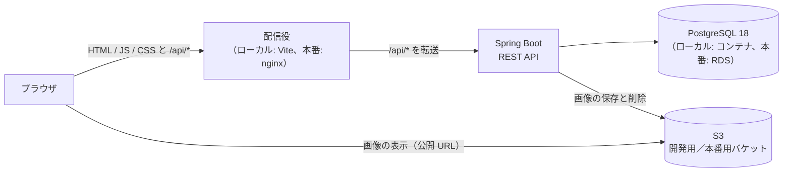
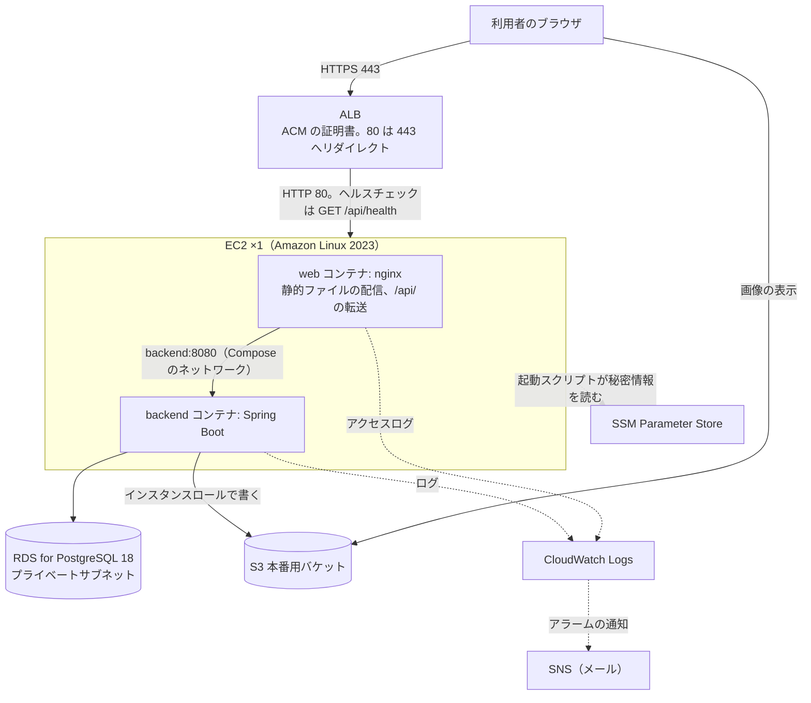

# システム構成

- 日付: 2026-10-06

## 1. 全体像

同一オリジンのモノリス構成にする。ブラウザから見ると、画面（React）も API（Spring Boot）も同じオリジンにあり、
画像だけ S3 から直接読む。CORS の設定は要らない。



| 部品 | 役割 |
| --- | --- |
| 配信役 | 静的ファイルを配り、`/api/` で始まる要求だけを Spring Boot に転送する。未知のパスは `index.html` を返す（SPA のルーティング） |
| Spring Boot | `/api` 配下の REST API。認証認可、入力検証、DB と S3 の読み書き |
| PostgreSQL | すべてのデータ。スキーマは Flyway で管理する |
| S3 | 投稿画像とアイコン画像。ブラウザは公開 URL で直接読む |

アプリは状態をサーバーに持たない（セッションは JWT、ファイルは S3）。そのため、ローカルと本番で同じ構造を保てる。

## 2. ローカル構成

今の Docker Compose（`frontend` / `backend` / `db` の 3 サービス）をそのまま使い、設定を足す。

```
ブラウザ ──→ frontend（Vite 開発サーバー :5173）
                │  /api/* を backend:8080 へ転送（vite.config.ts の server.proxy）
                ▼
             backend（Spring Boot :8080）──→ db（PostgreSQL 18）
                │
                └──→ S3 開発用バケット（インターネット経由。認証情報は .env から）
ブラウザ ──→ S3 開発用バケット（画像の表示）
```

- ローカルでも本物の S3 を使う。開発用バケットと、そのバケットだけを触れる IAM ユーザーを使う（[image-storage-design.md](image-storage-design.md)）。費用は月に数円〜十数円
- オフラインでは画像まわりだけ動かない。それ以外の機能はローカルで完結する
- backend の環境変数に、JWT の秘密鍵と S3 の設定が増える。土台の決定（`.env` を必須にしない。`docker compose up` だけで起動する）は守る。`JWT_SECRET` はローカル専用の既定値を `docker-compose.yml` に書く（DB のパスワードと同じ扱い）。`AUTH_COOKIE_SECURE=false` もローカル専用の値として `docker-compose.yml` に書く。S3 の変数は無くても起動し、無いときは画像の操作だけが 503 `IMAGE_STORAGE_UNAVAILABLE` になる
- 結合テスト用の DB `raise_timeline_test` を、`db` サービスの初期化スクリプト（`/docker-entrypoint-initdb.d/`）で作る。backend には `DB_URL_TEST` で渡し、テストのプロファイル（`application-test.properties`）だけがそれを使う（[test-strategy.md](test-strategy.md)）。初期化スクリプトは DB の初回起動時（データのボリュームが空のとき）だけ走り、テストのたびには走らない。既にある開発環境では `docker compose exec db psql -U raise_timeline -d raise_timeline -c 'CREATE DATABASE raise_timeline_test OWNER raise_timeline'` を 1 回だけ手で実行する。`docker compose down -v` で作り直すと、DB のデータに加えて依存とビルドのボリュームも消えるので使わない

`.env` で上書きできる変数は次のとおり。`.env` は `.gitignore` 済みで、コミットしない。S3 を使うときだけ `.env` が要る。

| 変数 | 中身 | 既定値（.env が無いとき） |
| --- | --- | --- |
| `JWT_SECRET` | アクセストークンの署名鍵。256 ビット以上の乱数を Base64 にしたもの | `docker-compose.yml` のローカル専用の値 |
| `AWS_ACCESS_KEY_ID` / `AWS_SECRET_ACCESS_KEY` | 開発用 IAM ユーザーのアクセスキー | 無し。無ければ画像の操作が 503 |
| `AWS_REGION` | `ap-northeast-1` | 無し |
| `S3_BUCKET` | 開発用バケット名 | 無し |
| `S3_PUBLIC_BASE_URL` | `https://<バケット名>.s3.ap-northeast-1.amazonaws.com` | 無し |
| `LOG_LEVEL_APP` | アプリのログの水準。`DEBUG` では SQL とその引数も出る。`INFO` にすると本番と同じ行だけになる | `DEBUG`（`docker-compose.yml` の既定値。アプリ自体の既定は `INFO`） |

`docker-compose.yml` はこれらを `backend` サービスの環境変数として渡す。変数の一覧は README にも書く。

## 3. 本番構成（仮決め）

AWS の東京リージョンに置く。**この構成は仮決めで、変わる可能性がある。** 変わっても困らないように、アプリは配信役・DB・S3 の
接続先を設定値だけで切り替えられるようにする。



### 部品

| 部品 | 内容 |
| --- | --- |
| VPC | 2 つの AZ。パブリックサブネットに ALB と EC2、プライベートサブネットに RDS |
| ALB | HTTPS（443）で受け、HTTP（80）は 443 へリダイレクト。証明書は ACM。ターゲットは EC2 の 80 番。ヘルスチェックは `GET /api/health` |
| EC2 | Amazon Linux 2023、t3.small 程度を 1 台。Docker と Docker Compose を入れ、`web`（nginx）と `backend`（Spring Boot）の 2 コンテナを動かす |
| RDS | PostgreSQL 18、db.t4g.micro、gp3 20 GB、単一 AZ、自動バックアップ 7 日、パブリックアクセスなし。接続は `sslmode=verify-full` にする |
| S3 | 本番用バケット。詳細は [image-storage-design.md](image-storage-design.md) |
| SSM Parameter Store | DB のパスワードと JWT の秘密鍵を SecureString で置く。無料 |
| CloudWatch Logs | アプリと nginx のログ。Docker の `awslogs` ログドライバで送る。ロググループは `/raise-timeline/backend` と `/raise-timeline/web`、保持は 90 日。ERROR などを数えるメトリクスフィルタとアラームもここに置く（[logging-design.md](logging-design.md) の 8〜9 章） |
| SNS | アラームの通知先。トピック `raise-timeline-alerts` にメールアドレスを 1 つ登録する。無料枠の中 |
| IAM | EC2 のインスタンスロールに、本番用バケットへの `PutObject` / `DeleteObject`、SSM の `GetParameter`、CloudWatch Logs への書き込み、SSM Session Manager で入るための `AmazonSSMManagedInstanceCore` を付ける |

### セキュリティグループ

| 対象 | 許可する通信 |
| --- | --- |
| ALB | インターネットから 443 と 80 |
| EC2 | ALB のセキュリティグループから 80 だけ。SSH（22）は開けない。作業は SSM Session Manager で行う |
| RDS | EC2 のセキュリティグループから 5432 だけ |

### 本番用の成果物とデプロイ

- `frontend/Dockerfile`（本番用）: `npm ci` → `npm run build` → nginx のイメージに `dist/` と `nginx.conf` を載せる
- `backend/Dockerfile`（本番用）: `./gradlew bootJar` → JRE のイメージに jar を載せる
- `compose.prod.yml`: `web` と `backend` の 2 サービス。DB と S3 の接続先は環境変数
- デプロイは EC2 上で `git pull` → `docker compose -f compose.prod.yml up -d --build` から始める。レジストリ（ECR）や自動デプロイは後回しにする
- 秘密情報は、起動スクリプトが SSM Parameter Store から読んで環境変数ファイルに書き、Compose に渡す。ファイルはルートだけが読める権限にする

### 拡張の余地

- アプリは状態を持たないので、EC2 を 2 台にしても設計は変わらない（ALB のターゲットに足すだけ）
- 画像の配信を CloudFront に変えるときは、`S3_PUBLIC_BASE_URL` を変えるだけでよい
- 画面の配信を S3 ＋ CloudFront に分けるときは、nginx の静的配信を外し、CORS の設定を足す

### 費用の目安（東京リージョン、2026 年 10 月時点の概算）

| 項目 | 月額 |
| --- | --- |
| ALB | 約 $20 |
| EC2 t3.small | 約 $20 |
| RDS db.t4g.micro ＋ 20 GB | 約 $20 |
| 公開 IPv4 アドレス ×3（ALB 2 個、EC2 1 個。1 個あたり月約 $3.6） | 約 $11 |
| S3、CloudWatch Logs、データ転送 | $1〜2 |
| 合計 | 約 $72〜73（月 $70 前後） |

### 本番構築の前に決めること

| 論点 | 内容 |
| --- | --- |
| ドメイン | ACM の証明書は自分で持つドメインにしか発行されない。HTTPS にはドメインが 1 つ要る。Route 53 で取るか、他で取って DNS だけ向けるか |
| AWS アカウントのプラン | 2025 年 7 月 15 日以降に作ったアカウントは、無料枠が「最大 $200 のクレジットを 6 か月」の方式。本番公開には有料プランへの切り替えが要る |
| インスタンスの大きさ | t3.small と db.t4g.micro から始め、足りなければ上げる |
| バケット名 | 全世界で一意。`raise-timeline-prod-<接尾辞>` の形 |
| 回数制限の値 | ログイン・登録・退会は 1 IP あたり毎分 20 回、バースト 20 から始める。教室の同じ NAT から一斉に登録しても詰まらない値に調整する |

## 4. 部品の役割と、新しく足す依存

| 部品 | 役割 | 足す依存 |
| --- | --- | --- |
| React | 画面。ルーティングは React Router。API の呼び出し・応答のキャッシュ・一覧の無限スクロールは TanStack Query で扱う | `@tanstack/react-query` |
| nginx | 静的ファイルの配信、圧縮、`/api` の転送、未知のパスを `index.html` に戻す、セキュリティヘッダー、ログイン・登録・退会の回数制限、ALB の後ろで利用者の IP を復元する | 本番用 Dockerfile と `nginx.conf` |
| Spring Boot | `/api` の REST API。認証認可は Spring Security と JWT。入力検証。S3 への保存 | `spring-boot-starter-security`、`spring-boot-starter-security-oauth2-resource-server`（JWT の発行と検証。追加の JWT ライブラリは入れない）、`spring-boot-starter-validation`、AWS SDK for Java v2 の `s3`、Apache Commons Imaging（JPEG の GPS 情報の除去。`1.0.0-alpha6` に固定し、使うのは `GpsMetadataRemover` の中だけ。Java で画素に触れずに Exif を書き換えられるのは実質これだけで、世界標準の ExifTool と Exiv2 は Java ではないため。alpha の危うさは単体テストとスマホの写真での手動確認で補う。[image-storage-design.md](image-storage-design.md) の 3 章）。テスト用に `spring-boot-starter-security-test` |
| PostgreSQL | データ。スキーマは Flyway、SQL は MyBatis の XML | なし |
| S3 | 画像 | なし |

TanStack Query を足す理由は、タイムラインやコメントの「20 件ずつ読み足す」処理と、いいね・フォローの楽観的更新を、
自前で書くより保守しやすく、学習効果も高いため。

## 5. 設定値の置き場

| 設定 | ローカル | 本番 |
| --- | --- | --- |
| DB の接続先・ユーザー・パスワード | `docker-compose.yml` の既定値 | RDS のエンドポイント。パスワードは SSM Parameter Store |
| JWT の秘密鍵 | `docker-compose.yml` のローカル専用の値（`.env` で上書きできる） | SSM Parameter Store |
| S3 のバケット名・リージョン・公開ベース URL | `.env` | 環境変数 |
| S3 の認証情報 | `.env` のアクセスキー（開発用バケット限定の IAM ユーザー） | EC2 のインスタンスロール（キーを置かない） |
| トークンの有効期限 | `application.properties` の既定値（アクセス 1 時間、リフレッシュ 30 日） | 同じ |
| 環境名（`APP_ENV`） | 無し。ログの `service.environment` は `local` になる | 環境変数で `production` |
| ログの水準（`LOG_LEVEL_APP`） | `docker-compose.yml` の既定値 `DEBUG`（`.env` で `INFO` にできる） | 環境変数で `INFO`。アプリ自体の既定も `INFO` |

Spring Boot 側では `application.properties` が `${JWT_SECRET}` のように環境変数を参照する。
AWS SDK は認証情報を標準の探索順（環境変数 → インスタンスロール）で見つけるので、ローカルと本番でコードは変わらない。

## 6. セキュリティ対策

### XSS を起こさない

| 対策 | 中身 |
| --- | --- |
| React のエスケープに乗る | 本文・コメント・自己紹介は React が文字列として描画する。`dangerouslySetInnerHTML` は使わない。本文中の URL をリンクにするときも HTML を組み立てず、React の要素として作る。リンクにするのは `http://` と `https://` で始まる URL だけ |
| Content Security Policy | nginx が `Content-Security-Policy` を返し、自分のオリジン以外のスクリプトと、インラインスクリプトの実行を拒否する。画像は S3 のオリジンと `blob:`（プレビュー）だけ許可する。値は本番構築の Issue で実測して決める |
| 外部スクリプトを読み込まない | 広告・解析タグなどの第三者スクリプトを入れない |
| 画像は別オリジンから配る | 画像は S3 のドメインから配る。偽装したファイルを上げられても、アプリの文脈では実行されない。形式は中身の先頭バイトで判定し、SVG は受け付けない |
| 依存の更新 | `npm audit` で既知の脆弱性を 0 件に保つ |

### 起きても被害を小さくする

- アクセストークンは JS のメモリにだけ置き、localStorage には置かない。XSS が起きれば、その場で更新 API を呼んでアクセストークンを得ることまでは防げないが、読み出して持ち去れるものが無く、被害は最長 1 時間に限られる
- リフレッシュトークンは httpOnly Cookie に置き、JS から読めない
- アクセストークンの有効期限は 1 時間。ログアウトでリフレッシュトークンをサーバー側で無効にする

### その他

| 対策 | 中身 |
| --- | --- |
| HTTPS | ALB で終端。HTTP は 443 へリダイレクト。本番の Cookie に `Secure` を付ける |
| セキュリティヘッダー | nginx が `X-Content-Type-Options: nosniff`、`X-Frame-Options: DENY`、`Referrer-Policy: strict-origin-when-cross-origin`、`Strict-Transport-Security: max-age=31536000` を返す |
| 総当たり対策 | nginx の `limit_req` で、ログインと登録の API と退会（`DELETE /api/users/me`。パスワードの再入力を総当たりで試せる口になるため）を 1 IP あたり毎分 20 回（バースト 20）に制限する。退会はメソッドが DELETE のときだけ数える（`map $request_method` で鍵を切り替える）。ALB の後ろでは接続元が ALB の IP になるので、`set_real_ip_from <VPC の CIDR>`、`real_ip_header X-Forwarded-For`、`real_ip_recursive on` で利用者の IP を復元してから数える。復元しないと全員で 1 つの枠を分け合い、復元を無条件にすると偽装で抜けられる |
| パスワード | BCrypt で保存。平文はログにも残さない |
| 認可 | すべての変更系 API で、ログイン中のユーザーが資源の持ち主かを確かめる（[auth-design.md](auth-design.md)） |
| 入力検証 | サーバーで必ず検証する。画面の検証は入力中に伝えるためのもの |
| アップロード | 1 枚 5 MB、1 要求 4 枚までを nginx と Spring の両方で制限する |
| 秘密情報 | リポジトリに置かない。ローカルは `.env`、本番は SSM Parameter Store |
| DB | インターネットから届かない。EC2 からだけ接続できる |
| EC2 | SSH を開けない。SSM Session Manager で入る |
| エラー応答 | 例外の文言・SQL・スタックトレースを本文に載せない（[error-handling-design.md](error-handling-design.md)） |
| リクエスト ID | 要求ヘッダー `X-Request-Id` は `^[A-Za-z0-9-]{1,64}$` に合うときだけ使い、合わなければ作り直す。利用者が送った値をそのままログと応答に書かない |
| 画面の遷移先 | ログイン後の戻り先 `next` は `/` で始まり、`//` と `/\` で始まらず、制御文字（タブ・改行）を含まない値だけ受け付ける |

## 7. 採らなかった案

| 案 | 採らなかった理由 |
| --- | --- |
| フロントを S3 ＋ CloudFront に分離し、EC2 は API だけ | CloudFront が増えて仮決めのインフラから外れる。オリジンが分かれるので CORS と Cookie の設計が要る。後から移る余地は残す |
| Spring Boot の jar に React のビルドを同梱し、nginx を置かない | 成果物は 1 つになるが、SPA のルーティング・圧縮・キャッシュを Spring に書き、フロントのビルドをバックエンドのビルドに組み込む必要がある。ローカルの構造からも遠くなる |
| EC2 に Java と nginx を直接入れて systemd で動かす | ローカルと道具が変わる。Docker ならローカルと同じ Dockerfile の延長で作れる |
| ECR と GitHub Actions で自動デプロイ | 最初から入れるほどの頻度ではない。手順が固まってから足す |
| ローカルの S3 の代わりに MinIO | MinIO の無償版は 2025 年 10 月に Docker イメージの配布をやめ、2026 年に開発を停止していた。S3Mock や RustFS も検討したが、本物の S3 の開発用バケットを使う方が本番との差が無く、費用も月に数円〜十数円で済む |
