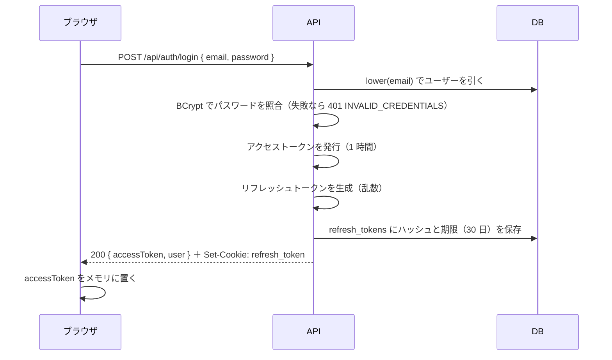
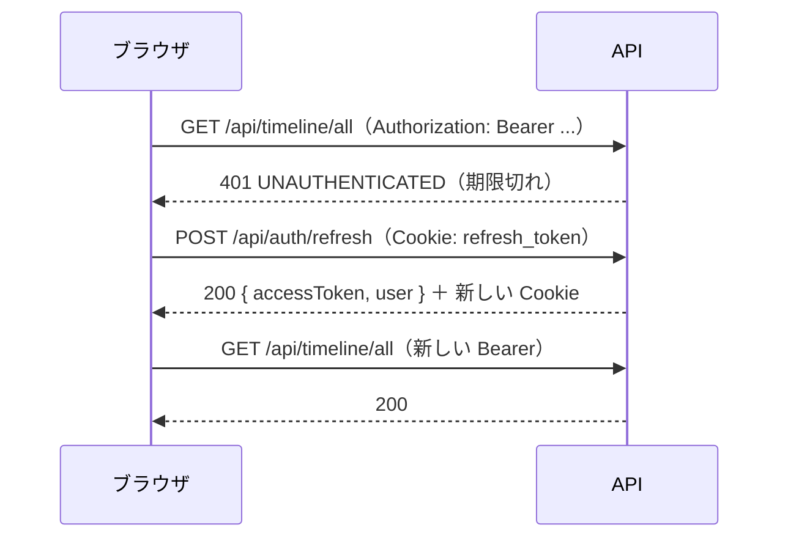
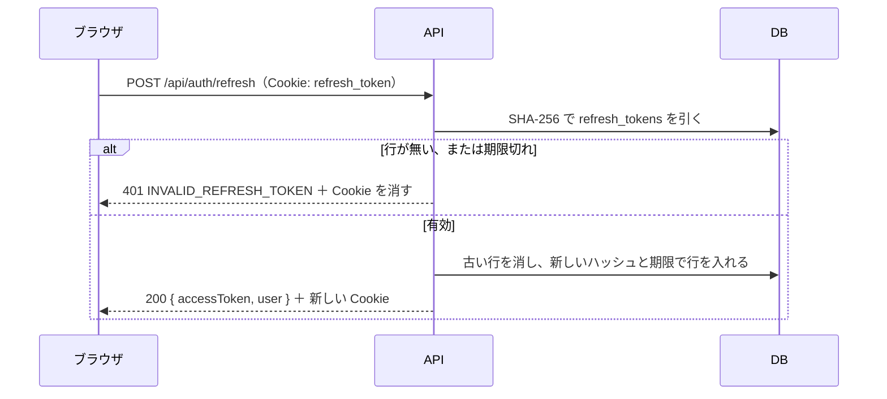
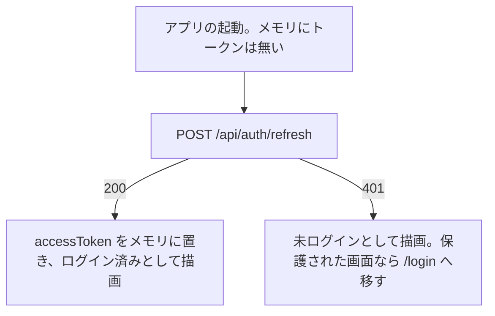

# 認証認可設計

- 日付: 2026-10-06

## 1. 方針

- 認証は JWT による。**有効期限 1 時間のアクセストークン**と、**有効期限 30 日のリフレッシュトークン**を併用する
- アクセストークンは JS のメモリにだけ置き、API 呼び出しの `Authorization: Bearer` ヘッダーで送る
- リフレッシュトークンは httpOnly Cookie に置き、更新とログアウトの API にだけ送られる。サーバーはハッシュを DB に持ち、ログアウトで無効にできる
- サーバーはセッションを持たない（ステートレス）。EC2 を増やしても設計は変わらない
- すべての画面と API はログインが要る。例外は登録・ログイン・更新・ヘルスチェックだけ

## 2. トークンの仕様

| | アクセストークン | リフレッシュトークン |
| --- | --- | --- |
| 形式 | JWT（HS256 で署名） | 256 ビットの乱数を Base64URL にした文字列。JWT ではない |
| 中身 | `sub`（ユーザー id）、`iat`、`exp`、`iss`（`raise-timeline`） | 意味のある中身は無い |
| 有効期限 | 発行から 1 時間 | 発行から 30 日 |
| 置き場所 | ブラウザの JS のメモリ | httpOnly Cookie |
| 送り方 | `Authorization: Bearer <token>` | ブラウザが Cookie として自動で送る |
| サーバー側の保存 | しない。署名を検証するだけ | `refresh_tokens` に SHA-256 のハッシュを保存する。トークンそのものは保存しない |
| 無効化 | できない（1 時間で切れる） | 行を消せば即座に無効 |
| 使うたび | 変わらない | 新しいものに差し替える（ローテーション）。古いものは消す |

Cookie の属性は次のとおり。

```
Set-Cookie: refresh_token=<token>; HttpOnly; Secure; SameSite=Lax; Path=/api/auth; Max-Age=2592000
```

- `HttpOnly`: JS から読めない。XSS で盗めない
- `Secure`: HTTPS でしか送らない。ブラウザは `http://localhost` を安全な文脈として扱うので、ローカルでも動く
- `SameSite=Lax`: 他のサイトからの POST には付かない。更新とログアウトを他サイトから呼ばせない
- `Path=/api/auth`: 更新とログアウト（と登録・ログイン）の API にしか送られない。他の API に毎回付いて回らない

署名鍵（`JWT_SECRET`）は 256 ビット以上の乱数で、環境変数から読む。鍵を変えると発行済みのアクセストークンはすべて無効になる（最長 1 時間で復帰する）。

## 3. 流れ

### 登録とログイン



登録（`POST /api/auth/register`）は、ユーザーを作ったあと同じ手順でトークンを返す。登録した瞬間からログイン済みになる。

### API の呼び出しと、期限切れのときの更新



- 401 のときに更新を試すのは **1 回だけ**。更新も 401 なら、ログアウト状態にしてログイン画面へ移す
- 複数の API 呼び出しが同時に 401 になっても、更新の要求は 1 本にまとめる（進行中の更新があればそれを待つ）。リフレッシュトークンは一度使うと消えるので、同時に 2 本送ると片方が失敗するため

### 更新（サーバー側）



### 画面の起動時



リロード・URL の直接入力・タブの開き直しのたびに、この 1 往復が入る。画面内の移動（React Router）ではメモリが保たれるので入らない。
往復の間は読み込み中の表示を出す。

### ログアウト

1. 画面で確認ダイアログを出す
2. `POST /api/auth/logout`（Cookie）。サーバーは該当の `refresh_tokens` の行を消し、Cookie を消す応答を返す
3. 画面はメモリのアクセストークンと利用者の情報を捨て、`/login` へ移す

アクセストークンは残り最長 1 時間有効だが、ブラウザから捨てているので使われない。

## 4. パスワード

- 保存は BCrypt（Spring Security の `BCryptPasswordEncoder`、強度は既定の 10）
- 入力は 8〜72 文字の半角英数字と記号（ASCII の印字可能文字）。BCrypt が 72 バイトまでしか見ないため、バイト数と文字数が一致する範囲に限る
- ログイン失敗の応答は「メールアドレスまたはパスワードが違います」の 1 種類。メールアドレスの有無を教えない
- ログインと登録は nginx で 1 IP あたり毎分 10 回に制限する（本番のみ。ローカルの Vite には無い）
- パスワードはログに出さない。要求本文をログに書くときはこの項目を伏せる

## 5. 公開 API と認可の規則

### 認証なしで呼べる API

| API | 理由 |
| --- | --- |
| `POST /api/auth/register` | 登録 |
| `POST /api/auth/login` | ログイン |
| `POST /api/auth/refresh` | Cookie で認証する |
| `POST /api/auth/logout` | Cookie で特定する。トークンが無くても 204 |
| `GET /api/health` | ALB のヘルスチェック |

それ以外の `/api/**` はすべて有効なアクセストークンが要る。無ければ 401 `UNAUTHENTICATED`。

### 認可の規則

| 操作 | 許す人 | それ以外 |
| --- | --- | --- |
| 投稿の編集・削除 | 投稿した本人 | 403 |
| コメントの削除 | 書いた本人 | 403 |
| プロフィールの更新、アイコンの更新 | 本人（`/api/users/me` なので他人を指定できない） | — |
| いいね・フォローの付け外し | 自分として行う操作のみ（URL に相手を指定し、主体はトークンの利用者） | — |
| 閲覧（タイムライン、プロフィール、一覧、検索） | ログイン済みなら誰でも | 401 |

判定は、サービス層で「資源の持ち主の id」と「トークンの `sub`」を比べて行う。存在しない資源は 404、存在するが他人のものは 403。
役割（管理者など）は無い。全員が同じ権限を持つ。

## 6. バックエンドの構成（Spring Security）

| 項目 | 内容 |
| --- | --- |
| セッション | `STATELESS`。`JSESSIONID` を発行しない |
| JWT の検証 | `spring-boot-starter-oauth2-resource-server` の `NimbusJwtDecoder` に HS256 の鍵を渡す。`Authorization: Bearer` を自動で読み、`sub` を認証情報にする |
| JWT の発行 | 同じ依存に含まれる `NimbusJwtEncoder`。追加の JWT ライブラリは入れない |
| 401 と 403 の応答 | `AuthenticationEntryPoint` と `AccessDeniedHandler` を差し替え、Problem Details の形で返す（[error-handling-design.md](error-handling-design.md)） |
| CSRF 対策 | Spring Security の CSRF トークンは無効にする。状態を変える API は Bearer ヘッダーで認証し、Cookie だけで動くのは更新とログアウトのみ。その 2 つは `SameSite=Lax` で他サイトからの POST を防ぎ、応答（アクセストークン）も他サイトからは読めない |
| パスワード | `BCryptPasswordEncoder` |
| リフレッシュトークンの生成 | `SecureRandom` で 32 バイト → Base64URL。保存は SHA-256 の 16 進文字列 |
| 期限切れの掃除 | 更新時に、その利用者の期限切れの行をついでに消す。定期の掃除は入れない |
| ログイン中の利用者 | コントローラは `@AuthenticationPrincipal` で `sub` を受け取る。サービス層には利用者 id を引数で渡す |

## 7. フロントの認証状態

| 項目 | 内容 |
| --- | --- |
| 状態の置き場 | React の Context（`AuthProvider`）。`accessToken`、`user`、`status`（`loading` / `authenticated` / `anonymous`）を持つ |
| 起動時 | `AuthProvider` が `POST /api/auth/refresh` を 1 回呼ぶ。終わるまで `loading` |
| 保護された画面 | `status` が `anonymous` なら `/login?next=<元のパス>` へ移す。ログイン後に `next` へ戻す |
| ログイン済みで `/login` `/register` | `/` へ移す |
| API クライアント | `fetch` を包む 1 つの関数。Bearer を付ける。401 なら更新を 1 回試してやり直す。更新は同時に 1 本だけ（進行中の Promise を共有する） |
| ログアウト | API を呼んでから状態を捨て、TanStack Query のキャッシュも消す（他人のデータを残さない） |

## 8. 設定値

| 設定 | 値 | 置き場 |
| --- | --- | --- |
| `JWT_SECRET` | 256 ビット以上の乱数（Base64） | ローカル `.env`、本番 SSM Parameter Store |
| アクセストークンの有効期限 | 1 時間 | `application.properties` |
| リフレッシュトークンの有効期限 | 30 日 | `application.properties` |
| Cookie 名 | `refresh_token` | `application.properties` |

## 9. 採らなかった案

| 案 | 採らなかった理由 |
| --- | --- |
| アクセストークンだけ（有効期限 7 日、localStorage） | 実装は少ないが、サーバー側でログアウトできず、盗まれると 7 日間使われる |
| アクセストークンを localStorage に置く | 起動時の 1 往復が要らなくなるが、XSS でトークンを持ち去られる。メモリなら持ち去れない |
| アクセストークンも httpOnly Cookie に置く | 全 API が Cookie 認証になり、CSRF 対策が全面的に要る。JWT を Bearer で送る形を学ぶ目的にも合わない |
| JWT ライブラリ（jjwt など）を足す | Spring Security の標準部品で発行も検証もできる。依存を増やさない |
| リフレッシュトークンの再利用検知（古いトークンが使われたら全部無効化） | 守りは強くなるが実装が増える。将来の課題にする |

## 10. 将来の課題

- リフレッシュトークンの再利用検知
- パスワードの変更・再設定（メール送信の仕組みが要る）
- メール確認
- 退会（`users` の削除と、S3 の画像の削除）
