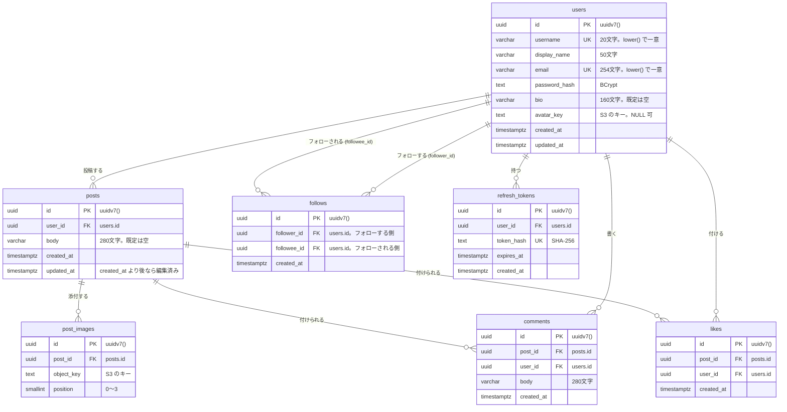

# DB 設計

- 日付: 2026-10-06

## 1. 方針

1. **主キーは UUID v7** にし、PostgreSQL 18 の `uuidv7()` で採番する。時刻順に並ぶので、「新しい順」の並びと一覧のカーソルを id だけで扱える。URL に出しても連番ではないので、件数や他人の投稿の存在を推測されない。RDS for PostgreSQL も 18 に対応している
2. **一覧の並び順とカーソルは、どのテーブルも id に統一する。** `WHERE id < :cursor ORDER BY id DESC LIMIT 21` の形
3. **件数は読み出すときに数える。** いいね数・コメント数・フォロー数の列を持たない。数万件の規模では十分速く、数を二重に持つことで起きる食い違いを避けられる
4. **削除は物理削除。** 外部キーはすべて `ON DELETE CASCADE`。投稿を消すと画像・いいね・コメントが一緒に消える。S3 の画像はアプリが消す
5. **日時は `timestamptz`** で UTC 保存
6. **画像は S3 のキーだけを持ち、URL は表示時に組み立てる。** 配信元を後から CloudFront に変えても DB を書き換えずに済む
7. **ユーザー名とメールアドレスは大文字小文字を区別せずに一意にする。** `lower()` の式インデックス
8. **外部キーの索引は明示的に作る。** PostgreSQL は外部キーに自動で索引を付けない

## 2. ER 図



線の端の記号は、`||` が「1」、`o{` が「0 以上」を表す。

- `likes` は `users` と `posts` の多対多を表す中間テーブル。1 行が「ユーザー X が投稿 Y にいいねした」という事実
- `follows` は `users` と `users` の多対多（自己参照）を表す中間テーブル。1 行が「`follower_id` の人が `followee_id` の人をフォローしている」という向きのある関係。相互フォローは 2 行になる
- `comments` も `users` と `posts` を結ぶが、本文という中身を持つので独立した実体として扱う
- `comments.user_id` と `likes.user_id` は「誰が書いたか／付けたか」。投稿の持ち主は `posts.user_id` をたどれば分かるので持たない

## 3. テーブル定義

共通の約束: `id` は `uuid` で `DEFAULT uuidv7()`、`created_at` と `updated_at` は `timestamptz NOT NULL DEFAULT now()`。
`updated_at` の更新はアプリが行う（トリガーは使わない）。

### users（利用者）

| 列 | 型 | NULL | 既定値 | 説明 |
| --- | --- | --- | --- | --- |
| id | uuid | 不可 | uuidv7() | 主キー |
| username | varchar(20) | 不可 | | 英数字と `_`。3〜20 文字。登録後は変えない。URL に使う |
| display_name | varchar(50) | 不可 | | 表示名。1〜50 文字 |
| email | varchar(254) | 不可 | | ログイン ID |
| password_hash | text | 不可 | | BCrypt のハッシュ。平文は持たない |
| bio | varchar(160) | 不可 | '' | 自己紹介 |
| avatar_key | text | 可 | | アイコン画像の S3 キー。未設定なら NULL |
| created_at | timestamptz | 不可 | now() | 登録日時 |
| updated_at | timestamptz | 不可 | now() | 更新日時 |

- 一意: `lower(username)`、`lower(email)`（式インデックス）
- チェック: `username ~ '^[A-Za-z0-9_]{3,20}$'`

### refresh_tokens（リフレッシュトークン）

| 列 | 型 | NULL | 既定値 | 説明 |
| --- | --- | --- | --- | --- |
| id | uuid | 不可 | uuidv7() | 主キー |
| user_id | uuid | 不可 | | 持ち主。users.id |
| token_hash | text | 不可 | | トークンの SHA-256。トークンそのものは保存しない |
| expires_at | timestamptz | 不可 | | 有効期限（発行から 30 日） |
| created_at | timestamptz | 不可 | now() | |

- 外部キー: `user_id → users.id`（CASCADE）
- 一意: `token_hash`
- 索引: `(user_id)`。ログアウト時にその人の行を消すため

### posts（投稿）

| 列 | 型 | NULL | 既定値 | 説明 |
| --- | --- | --- | --- | --- |
| id | uuid | 不可 | uuidv7() | 主キー。新しい順の並びとカーソルに使う |
| user_id | uuid | 不可 | | 投稿者。users.id |
| body | varchar(280) | 不可 | '' | 本文。画像が無いときは空にできない（アプリで検証） |
| created_at | timestamptz | 不可 | now() | 投稿日時 |
| updated_at | timestamptz | 不可 | now() | created_at より後なら「編集済み」 |

- 外部キー: `user_id → users.id`（CASCADE）
- 索引: `(user_id, id)`。プロフィールの投稿一覧とフォロー中タイムラインに使う

### post_images（投稿に添付した画像）

| 列 | 型 | NULL | 既定値 | 説明 |
| --- | --- | --- | --- | --- |
| id | uuid | 不可 | uuidv7() | 主キー |
| post_id | uuid | 不可 | | posts.id |
| object_key | text | 不可 | | S3 のキー |
| position | smallint | 不可 | | 表示順。0〜3 |

- 外部キー: `post_id → posts.id`（CASCADE）
- 一意: `(post_id, position)`
- チェック: `position BETWEEN 0 AND 3`

### likes（いいね）

| 列 | 型 | NULL | 既定値 | 説明 |
| --- | --- | --- | --- | --- |
| id | uuid | 不可 | uuidv7() | 主キー。「いいねした人の一覧」のカーソルに使う |
| post_id | uuid | 不可 | | posts.id |
| user_id | uuid | 不可 | | 付けた人。users.id |
| created_at | timestamptz | 不可 | now() | |

- 外部キー: `post_id → posts.id`、`user_id → users.id`（どちらも CASCADE）
- 一意: `(post_id, user_id)`。1 人 1 回を DB でも守る
- 索引: `(post_id, id)`。いいねした人の一覧

### comments（コメント）

| 列 | 型 | NULL | 既定値 | 説明 |
| --- | --- | --- | --- | --- |
| id | uuid | 不可 | uuidv7() | 主キー。新しい順の並びとカーソルに使う |
| post_id | uuid | 不可 | | posts.id |
| user_id | uuid | 不可 | | 書いた人。users.id |
| body | varchar(280) | 不可 | | 1〜280 文字 |
| created_at | timestamptz | 不可 | now() | |

- 外部キー: `post_id → posts.id`、`user_id → users.id`（どちらも CASCADE）
- チェック: `length(body) >= 1`
- 索引: `(post_id, id)`

### follows（フォロー関係）

| 列 | 型 | NULL | 既定値 | 説明 |
| --- | --- | --- | --- | --- |
| id | uuid | 不可 | uuidv7() | 主キー。一覧のカーソルに使う |
| follower_id | uuid | 不可 | | フォローする側。users.id |
| followee_id | uuid | 不可 | | フォローされる側。users.id |
| created_at | timestamptz | 不可 | now() | |

- 外部キー: `follower_id → users.id`、`followee_id → users.id`（どちらも CASCADE）
- 一意: `(follower_id, followee_id)`。同じ人を 2 回フォローできない
- チェック: `follower_id <> followee_id`。自分自身をフォローできない
- 索引: `(followee_id, id)` フォロワー一覧用、`(follower_id, id)` フォロー中一覧用

## 4. インデックスの考え方

索引は、実際に走る問い合わせに合わせて付ける。付けるほど書き込みが遅くなり容量も増えるので、使われない索引は持たない。

| 索引 | 速くする問い合わせ | 付けない理由があるもの |
| --- | --- | --- |
| `posts (user_id, id)` | その人の投稿を新しい順に（プロフィール）。フォロー相手の投稿を新しい順に（フォロー中タイムライン）。`user_id` でまとめ、その中が `id` 順なので、並べ替えなしに末尾から読める | `user_id` 単独の索引は要らない。2 列の索引は先頭の列だけの検索にも使える |
| `likes (post_id, user_id)`（一意制約） | 「自分がいいね済みか」「投稿のいいね数」 | |
| `likes (post_id, id)` | いいねした人の一覧を新しい順に | `user_id` から引く索引は無い。「このユーザーがいいねした投稿の一覧」は範囲外のため |
| `comments (post_id, id)` | 投稿のコメント一覧を新しい順に。コメント数 | `user_id` から引く索引は無い。「このユーザーのコメント一覧」は範囲外のため。削除の認可は主キーで 1 行引いてから `user_id` を見るだけ |
| `follows (followee_id, id)` と `(follower_id, id)` | フォロワー一覧とフォロー中一覧。逆方向から引く機能が両方あるので 2 本 | |
| `users lower(username)`、`lower(email)` | 一意性の保証。プロフィール URL とログインの完全一致の検索 | 部分一致のユーザー検索には使えない。数百人なら全件走査で十分。数万人になったら `pg_trgm` を足す |

退会（ユーザーの削除）を将来足すときは、連鎖削除で `likes` と `comments` の行を探すために `user_id` の索引も一緒に足す。

## 5. 代表的な問い合わせ

フォロー中タイムライン。21 件取って、21 件目があれば「次がある」と判断し、20 件を返す。

```sql
SELECT p.*
FROM posts p
WHERE (p.user_id = :me OR p.user_id IN (SELECT followee_id FROM follows WHERE follower_id = :me))
  AND (:cursor::uuid IS NULL OR p.id < :cursor)
ORDER BY p.id DESC
LIMIT 21;
```

投稿に付く数と「自分がいいね済みか」は、投稿の一覧を取ったあとに、その投稿 id の集合に対してまとめて数える（N+1 にしない）。

```sql
SELECT post_id, count(*) AS like_count FROM likes WHERE post_id = ANY(:ids) GROUP BY post_id;
SELECT post_id FROM likes WHERE user_id = :me AND post_id = ANY(:ids);
```

ユーザー検索。`%` と `_` はエスケープしてから使う。

```sql
SELECT * FROM users
WHERE (username ILIKE '%' || :q || '%' ESCAPE '\' OR display_name ILIKE '%' || :q || '%' ESCAPE '\')
  AND (:cursor::uuid IS NULL OR id < :cursor)
ORDER BY id DESC
LIMIT 21;
```

## 6. マイグレーション

機能の Issue ごとに 1 本ずつ足す。置き場所は `backend/src/main/resources/db/migration/`。一度当てたファイルは直さず、次の番号で直す。

| ファイル | 中身 | Issue |
| --- | --- | --- |
| `V1__users.sql` | `users`、`refresh_tokens` | 認証の基盤 |
| `V2__posts.sql` | `posts`、`post_images` | 投稿とタイムライン |
| `V3__likes.sql` | `likes` | いいね |
| `V4__comments.sql` | `comments` | コメント |
| `V5__follows.sql` | `follows` | フォロー |

`post_images` は投稿の Issue で作る。画像の Issue では DB を変えない。

## 7. 採らなかった案

| 案 | 採らなかった理由 |
| --- | --- |
| 主キーを `bigint` の連番にする | 単純だが、URL に出すと件数と存在が推測できる。UUID v7 なら時刻順も保てる |
| UUID v4 | 時刻順にならないので、並びとカーソルに `created_at` が別に要る。索引の局所性も悪い |
| いいね数などを列に持つ（非正規化） | 数が食い違ったときに直す仕組みが要る。数万件の規模では数える方が単純で速い |
| 論理削除（`deleted_at`） | すべての問い合わせに「消えていない」条件が要る。復元の要件が無い |
| 「編集済み」の列を持つ | `updated_at > created_at` で分かる |
| `comments` に投稿の持ち主を持つ | `posts.user_id` で分かる。同じ情報を 2 か所に持たない |
