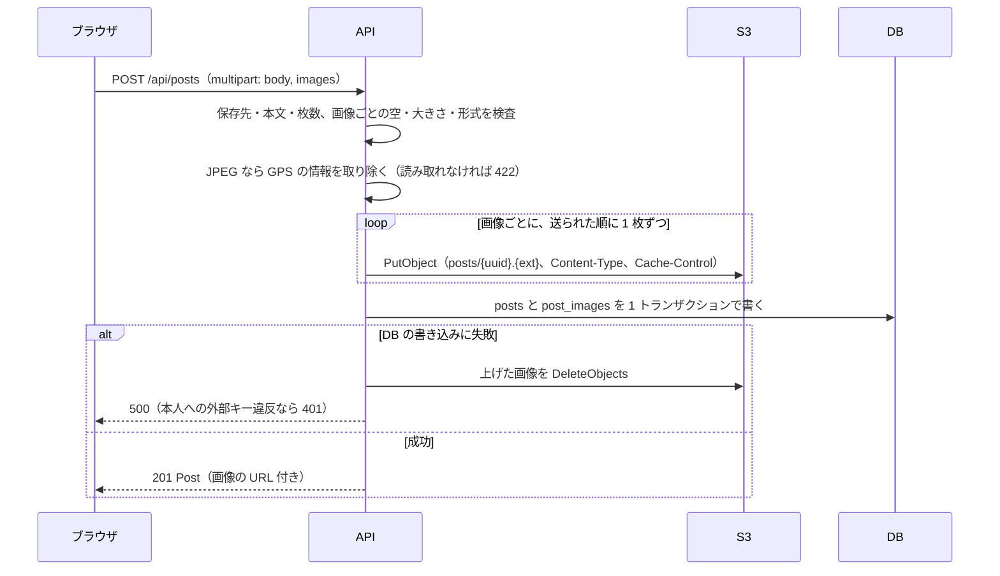

# 画像保存設計

- 日付: 2026-10-06

投稿の画像とプロフィールのアイコンを Amazon S3 に保存する。ローカル開発でも本物の S3（開発用バケット）を使い、
自動テストでは保存処理を代役に差し替える。

## 1. バケット

| 項目 | 内容 |
| --- | --- |
| バケット | 開発用と本番用の 2 つ。リージョンは東京（ap-northeast-1）。名前は全世界で一意なので `raise-timeline-dev-<接尾辞>`、`raise-timeline-prod-<接尾辞>` |
| 読み取り | バケットポリシーで、誰でも個々のオブジェクトを `GetObject` できるようにする。SNS の画像は公開情報。一覧（`ListBucket`）は許可しないので、キーを知らない画像は探せない |
| パブリックアクセスのブロック | このバケットだけ、バケットポリシーに関する 2 項目（`BlockPublicPolicy`、`RestrictPublicBuckets`）を外す。ACL に関する 2 項目は有効のまま |
| 書き込み | 開発は開発用バケット限定の IAM ユーザー、本番は EC2 のインスタンスロール。どちらも `PutObject` と `DeleteObject` だけ |
| CORS | 要らない。表示は `` で、アップロードはバックエンド経由 |
| バージョニング | 無効 |
| ライフサイクル | 途中で止まった multipart アップロードを 1 日で破棄する規則だけ |
| 暗号化 | 既定（SSE-S3） |

バケットポリシー（読み取り用）。

```json
{
  "Version": "2012-10-17",
  "Statement": [
    {
      "Sid": "PublicRead",
      "Effect": "Allow",
      "Principal": "*",
      "Action": "s3:GetObject",
      "Resource": "arn:aws:s3:::raise-timeline-dev-<接尾辞>/*"
    }
  ]
}
```

IAM ポリシー（書き込み用。開発用ユーザーと本番用ロールに、それぞれのバケットで付ける）。

```json
{
  "Version": "2012-10-17",
  "Statement": [
    {
      "Effect": "Allow",
      "Action": [ "s3:PutObject", "s3:DeleteObject" ],
      "Resource": "arn:aws:s3:::raise-timeline-dev-<接尾辞>/*"
    }
  ]
}
```

## 2. キーの設計

| 用途 | キー | 例 |
| --- | --- | --- |
| 投稿画像 | `posts/<ランダムな UUID>.<拡張子>` | `posts/8f3a1c2d-....jpg` |
| アイコン | `avatars/<ユーザー id>/<ランダムな UUID>.<拡張子>` | `avatars/0199b000-.../4b7d....png` |

- キーに投稿 id を入れないのは、DB に書く前に S3 へ上げるため（失敗時に消しやすい順序）
- アイコンもアップロードのたびに新しいキーにする。同じキーで上書きすると、ブラウザが古い画像をキャッシュしたまま表示する。差し替え後に古いオブジェクトを消す
- 拡張子は、申告されたファイル名ではなく、中身の先頭バイトで判定した形式から付ける（`jpg` `png` `gif` `webp`）
- アップロード時に `Content-Type` と `Cache-Control: public, max-age=31536000, immutable` を付ける。キーは一度きりで上書きしないので、ブラウザに 1 年キャッシュさせてよい
- DB にはキーだけを持つ（`post_images.object_key`、`users.avatar_key`）。URL は `S3_PUBLIC_BASE_URL + "/" + キー` で組み立てる

## 3. 検査

| 検査 | 投稿画像 | アイコン | 失敗時 |
| --- | --- | --- | --- |
| 枚数 | 0〜4 | 1 | 422 |
| 大きさ | 1 枚 5 MB まで | 2 MB まで | 413（`detail` は投稿もアイコンも「画像が大きすぎます」） |
| 形式 | JPEG / PNG / GIF / WebP。先頭バイト（マジックナンバー）で判定 | 同じ | 415 |
| 空のファイル | 不可 | 不可 | 422「画像を読み取れませんでした」 |
| 読み取れない JPEG（位置情報を取り除く処理で解析に失敗する） | 不可 | 不可 | 422 |

大きさの単位は 2 進で数える。5 MB は 5,242,880 バイト、2 MB は 2,097,152 バイト（Spring の `DataSize` と同じ）。

- SVG は受け付けない（スクリプトを含められる）
- JPEG は、保存の前に Exif のうち GPS のディレクトリ（GPS IFD。撮影地の座標）だけを取り除き、Orientation（写真の向き）などの他のタグは残す。Apache Commons Imaging で `TiffImageMetadata` から `TiffOutputSet` を取り、GPS のディレクトリを除いて `ExifRewriter.updateExifMetadataLossless` で書き戻す。画素は変えない。向きのタグを消すと、縦に撮った写真が横倒しで表示されるため、丸ごとは消さない。XMP（APP1 の別の形式。`exif:GPSLatitude` などが入ることがある）は、標準の XMP（識別子 `http://ns.adobe.com/xap/1.0/`）と、64KB を超えたときに使われる Extended XMP（識別子 `http://ns.adobe.com/xmp/extension/`）のどちらの APP1 も丸ごと取り除く。ライブラリの `JpegXmpRewriter.removeXmpXml` が消すのは標準の XMP だけで、Extended XMP が残って GPS が漏れるため、`GpsMetadataRemover` の中で `JpegRewriter` を継承して、取り除く条件を差し替えている。GPS が無い JPEG は Exif を書き換えない（XMP の除去は行う）。PNG / GIF / WebP は対象外（スマホの写真にはまず使われず、位置情報を持つこともまれ）で、そのまま保存する
- Apache Commons Imaging は `1.0.0-alpha6` に固定し、使うのは `GpsMetadataRemover` の中だけにする。Java で、画素に触れずに Exif だけを書き換えられるライブラリは、実質これしかない（世界標準の ExifTool と Exiv2 は Java ではない）。alpha 版である危うさは、単体テスト（GPS が消える、Orientation が残る、Exif の無い JPEG が通る）と、スマホで撮った写真での手動確認で補う。他のクラスが直接使わないので、置き換えるときの影響はこのクラスに収まる
- JPEG の解析に失敗したら（先頭のバイトだけ JPEG で中身が壊れているなど）、422「画像を読み取れませんでした」にする。解析は Exif だけを読む（`JpegImageParser.getExifMetadata`）。`Imaging.getMetadata` は APP13（Photoshop / IPTC）も解析し、そこが壊れていると例外になるため、位置情報と関係の無い部分の不具合で本物の写真まで弾いてしまう。位置情報を消せないまま保存すると撮影地が漏れるおそれがあるので、保存しない。利用者の入力で起きる失敗なので、500 にもしない
- 画像の縦横の大きさは検査しない。縮小もしない。表示は CSS で収める。大きな画像の縮小は将来の課題
- 検査の順序は、投稿の作成では (1) 画像があるのに保存先が使えなければ 503、(2) 本文（422）、(3) 枚数（5 枚以上は 422「画像は 4 枚までです」。項目は `images`）、(4) 画像を送られた順に 1 枚ずつ、空（422）、大きさ（413）、形式（415）、読み取れない JPEG（422）。**画像はすべて検査してから、1 枚も保存しないうちに** 上げ始める。アイコンは (1) と (4) だけで、項目は `file`。大きさを形式より先に見るのは、大きなファイルの先頭を調べる前に断るため。ただし 1 ファイルが 5 MB（`spring.servlet.multipart.max-file-size`）を超えるか、要求全体が 21 MB（`max-request-size`）を超えると、Spring が multipart を解析する途中で 413 にするので、この順序より前に止まる（保存先や本文に関係なく 413）。投稿画像の 5 MB は Spring の上限と同じ値なので、実質ここで決まる。アイコンの 2 MB は、2〜5 MB ならこの順序の (4) で 413 になる
- 画面でも、ファイル選択の時点で検査して先に伝える（最終判断はサーバー）。順序は **形式、大きさ** で、サーバーと逆になる。SVG を選んだ人に「大きすぎる」と言うと、小さくすれば通ると誤解させるため。形式は、MIME が 4 種のどれか、または拡張子が jpg / jpeg / png / gif / webp（大文字小文字を区別しない）なら通す。OS が拡張子から MIME を決められず、空になることがあるため。通らなかったファイルは追加せず、文言を出す。5 枚目以降は追加せず「画像は 4 枚までです」を出す（4 枚目までは追加する）
- 413 の `detail` は「画像が大きすぎます」で、投稿とアイコンに共通する。上限が違う（5 MB と 2 MB）ので、画面がステータスで判断して、欄ごとの文言「画像は 5 MB 以内にしてください」「画像は 2 MB 以内にしてください」に置き換える。415 は「JPEG、PNG、GIF、WebP の画像を選んでください」を欄の下に出す。ステータスで決めるので、nginx が返す HTML の 413 でも同じ文言になる

## 4. アップロードの流れ

### 投稿



S3 への PUT はトランザクションの外で行い、DB の書き込みだけをトランザクションにする。S3 の削除はコミットの後で行う（[error-handling-design.md](error-handling-design.md) の 3 章）。

S3 への保存が途中で失敗したときも、それまでに上げた分を消して 500 を返す。

受け入れているリスクが 1 つある。DB の書き込みが例外になっても、実際にはコミットが済んでいることがある（コミットの後で接続が切れたときなど）。そのとき後始末は、新しく上げたキーを消してしまい、保存された行からその画像が参照されて壊れて見える。まれにしか起きず、アイコンは上げ直せば直るので、受け入れる（コードでは防がない）。アイコンの差し替えも同じ。

画像は並行に上げず、1 枚ずつ順に上げる。理由は 3 つ。

- 待ち時間の大半は、ブラウザからバックエンドへのアップロードで決まる。S3 への PUT を並行にしても縮まる時間は小さい
- 余分なスレッドを使わないので、MDC（要求 id などをログに載せる仕組み）を引き継ぐ手間が要らない（[logging-design.md](logging-design.md) の 4 章）
- 失敗したときは、そこまでに上げたキーを消すだけで済む。並行だと、どこまで上がったかの管理が要る

### アイコン

1. `PUT /api/users/me/avatar`（multipart: file）
2. 保存先が使えなければ 503。使えるなら、空・大きさ・形式を検査し、JPEG なら GPS の情報を取り除く（読み取れなければ 422。S3 には上げない）
3. 新しいキーで S3 に上げる
4. 次の 1 文で `users.avatar_key` と `updated_at` を更新し、差し替え前のキーを受け取る（PostgreSQL 18 の `RETURNING OLD`）

   ```sql
   UPDATE users SET avatar_key = #{key}, updated_at = #{updatedAt} WHERE id = #{id}
   RETURNING id AS user_id, OLD.avatar_key AS old_key
   ```

5. 受け取った古いキーがあれば S3 から消す。失敗は WARN の出来事 `image.delete_failed` にとどめ、応答は成功（[logging-design.md](logging-design.md) の 3 章）
6. `{ "avatarUrl": "..." }` を返す

古いキーを、更新の前に読むのではなく、更新と同じ文で受け取る。読んでから書くと、同時に 2 回差し替えたときに二人が同じ古いキーを拾い、片方の画像が孤児になる。同じ文なら、各回が「自分が置き換えた 1 つ前のキー」だけを受け取るので、孤児も二重の削除も起きない。`id` も返すのは、初めての設定だと `old_key` が null で、行の全部の列が null になると MyBatis が結果を null にしてしまい、「行が無い」と区別できなくなるため。

- 行が無い（更新で 1 行も返らない）のは、トークンの有効期間中に退会したということ。上げた新しいキーを消して、401 を返す
- DB の更新が例外になったときも、上げた新しいキーを消す（投稿の作成と同じ方針。どの行からも参照されない画像を残さない）

### 削除

- 投稿の削除: 先に画像のキーを読み、DB の行を消す（`post_images` は連鎖で消える）→ S3 のオブジェクトを `DeleteObjects` でまとめて消す。S3 側の失敗は `image.delete_failed` にとどめ、応答は 204
- 退会: `users` の行を消す前に、その人の投稿画像のキー（`post_images` を `posts.user_id` でたどる）とアイコンのキーを集め、DB をコミットしてから `DeleteObjects` でまとめて消す（1 回 1,000 件まで。超えたら分ける）。失敗は `image.delete_failed` に消せなかったキー（`app.image.keys`）を載せてとどめ、応答は 204
- 残った孤児の画像は、利用者には見えない（DB から参照されない）。定期的な掃除は範囲外とし、将来の課題にする

## 5. コードの構成

```java
public interface ImageStorage {
    /** 保存先として使えるか。DisabledImageStorage だけが false */
    boolean isAvailable();
    /** 保存して公開 URL を返す */
    String put(String key, byte[] content, String contentType);
    void deleteAll(List<String> keys);
    /** キーから公開 URL を作る。保存先が使えないときは null */
    String urlOf(String key);
}
```

操作は 4 つだけにする。1 件だけ消す `delete` は持たない。消す場面はどれも「投稿やアイコンに結びついたキーをまとめて」なので `deleteAll` で足り、入口を増やすと失敗の扱いが散らばるため。

| 実装 | 用途 |
| --- | --- |
| `S3ImageStorage` | 本番とローカルの実行時。AWS SDK for Java v2 の `S3Client` を使う。数十行の薄い部品にとどめる |
| `DisabledImageStorage` | S3 の設定（`S3_BUCKET`）が無いときに使う。`isAvailable()` は false で、`put` は `ImageStorageUnavailableException` を投げ、503 になる。`deleteAll` も例外を投げるが、呼ぶのは `ImageCleaner` だけで、WARN にとどめる。`urlOf` は null を返す。設定が無くてもアプリが起動するため |
| Mockito の代役、または `InMemoryImageStorage`（テスト用） | 自動テスト。どこにも保存しない（[test-strategy.md](test-strategy.md)）。テストのプロファイルは `image-storage.bucket=` と空にして、自動テストが本物の S3 に届かないようにする |

- 画像の形式判定は `ImageTypeDetector`（先頭バイトを見る）に分け、単体テストで確かめる
- キーの生成は `ImageKeys`（`posts/...`、`avatars/...`）に分ける
- GPS の除去は `GpsMetadataRemover` に分け、GPS を含む JPEG を渡すと GPS が無くなり、Orientation が残ることと、Exif の無い JPEG がそのまま通ることを単体テストで確かめる
- S3 の削除は `ImageCleaner.deleteQuietly` を通す。失敗しても呼び出し元には伝えず、WARN の出来事 `image.delete_failed` に消せなかったキー（`app.image.keys`、配列）と原因を載せる。使うのは 4 か所で、投稿の削除のあと、投稿の作成の失敗の後始末（上げた分）、アイコンの差し替え（古いキー。401 や DB の失敗では新しいキー）、退会のあと（集めた投稿画像とアイコンのキー。応答は 204 のまま）
- 応答に載せる URL は、キーから `urlOf` で作る。URL を作れない（保存先が使えない）画像は応答から外し、アイコンは null にする
- S3 クライアントは `apiCallTimeout` 30 秒、再試行 2 回にする

## 6. 設定

| 変数 | ローカル | 本番 |
| --- | --- | --- |
| `AWS_REGION` | `.env`（`ap-northeast-1`） | 環境変数 |
| `S3_BUCKET` | `.env`（開発用バケット名） | 環境変数（本番用バケット名） |
| `S3_PUBLIC_BASE_URL` | `.env`（`https://<バケット>.s3.ap-northeast-1.amazonaws.com`） | 環境変数。CloudFront に変えるときはここだけ変える |
| `AWS_ACCESS_KEY_ID` / `AWS_SECRET_ACCESS_KEY` | `.env`（開発用 IAM ユーザー） | 置かない。インスタンスロールを SDK が自動で使う |

`S3_BUCKET` が無いときは `DisabledImageStorage` が使われ、画像の操作だけが 503 になる。それ以外の機能は動く。

AWS SDK は認証情報を標準の探索順（環境変数 → … → インスタンスロール）で見つけるので、コードはローカルと本番で変わらない。

### ローカルの準備（人が行う）

1. AWS コンソールで開発用バケットを作り、バケットの「パブリックアクセスのブロック」のうちバケットポリシーに関する 2 項目を外して、上のバケットポリシーを付ける。アカウント単位の「パブリックアクセスのブロック」も、バケットポリシーに関する項目を外しておく必要がある
2. 開発用の IAM ユーザーを作り、上の IAM ポリシーを付けて、アクセスキーを発行する
3. リポジトリ直下の `.env` に `AWS_ACCESS_KEY_ID`、`AWS_SECRET_ACCESS_KEY`、`AWS_REGION`、`S3_BUCKET`、`S3_PUBLIC_BASE_URL` を書く
4. `docker compose up -d` で backend に渡る

手順の詳細は、[README.md](../README.md) の「画像の保存（S3）の準備」にある。

## 7. 費用

東京リージョンの S3 Standard は、保存 1 GB あたり月 $0.025、PUT 1,000 回あたり $0.0053、GET 1,000 回あたり $0.00042、
インターネットへの転送は月 100 GB まで無料。開発中は月 $0.06 前後（10 円ほど）。

## 8. 安全面

- 形式は先頭バイトで判定し、SVG と非画像を拒否する
- 画像の配信元はアプリとは別のオリジン（S3 のドメイン）。偽装ファイルを上げられてもアプリの文脈では実行されない
- アップロードできるのはログイン済みの本人だけ
- 1 要求あたりの大きさを nginx と Spring の両方で制限する
- バケットの一覧は公開しない。キーは推測できない UUID
- JPEG の GPS の情報（Exif の GPS IFD と XMP）は保存の前に取り除く。撮影地の座標を公開しない
- 上限を超える大きさの要求は、Tomcat の `max-swallow-size` の都合で 413 ではなく接続の切断（nginx 越しでは 502）になることがある。画面は選んだ時点で止めるので、利用者がこれに当たることはまずない。手動確認で 10 MB の画像を選び、画面の文言が出ることを確かめる

## 9. 採らなかった案

| 案 | 採らなかった理由 |
| --- | --- |
| ブラウザから署名付き URL で S3 へ直接上げる | EC2 の負荷は減るが、S3 の CORS 設定、2 段階の投稿処理、途中で放棄された画像の掃除が要る。バックエンド経由なら形式の検査も 1 か所で済む |
| 署名付き URL で読む（非公開バケット） | URL に期限が付き、キャッシュが効かず、応答のたびに署名の生成が要る。SNS の画像は公開情報なので公開読み取りでよい |
| ローカルは S3 互換の模擬サーバー（MinIO、S3Mock、RustFS） | MinIO の無償版は配布が終わっていた。本物の開発用バケットなら本番との差が無く、費用も月に数円〜十数円 |
| サーバー側で縮小する | 実装が増える。表示は CSS で収まる。必要になったら足す |
| CloudFront で配る | 最初から要らない。`S3_PUBLIC_BASE_URL` を変えるだけで移れる |
