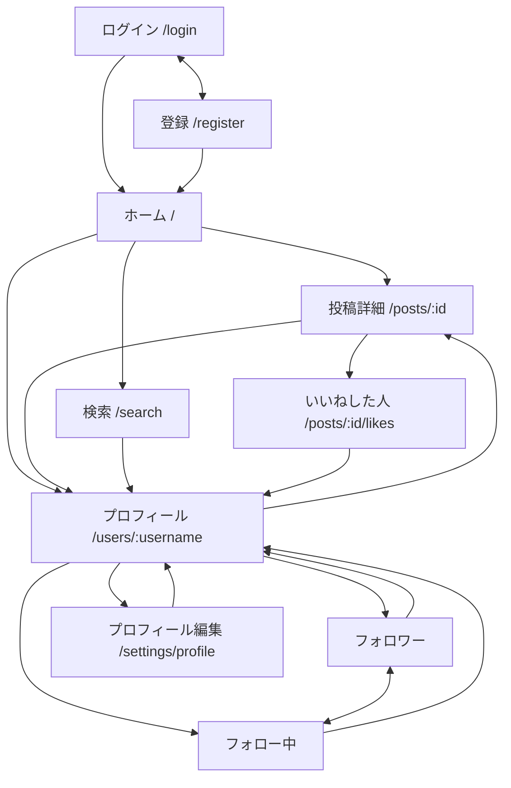

# 画面設計（横断部分）

- 日付: 2026-10-06

画面ごとの項目・検証・動きは `features/` の各文書にある。ここは画面の一覧、遷移、共通レイアウト、共通部品、表示の規則。

## 1. 画面一覧

| 画面 | パス | 認証 | 文書 |
| --- | --- | --- | --- |
| 登録 | `/register` | 不要 | [auth](features/auth.md) |
| ログイン | `/login`（`?next=<戻り先>`） | 不要 | auth |
| ホーム（タイムライン） | `/`（タブは `?tab=following` / `?tab=all`。省くとフォロー中。Issue 3〜8 は「すべて」だけで、既定も「すべて」） | 要 | [timeline](features/timeline.md)、[post](features/post.md) |
| 投稿詳細 | `/posts/:id` | 要 | post、[comment](features/comment.md) |
| いいねした人 | `/posts/:id/likes` | 要 | [like](features/like.md) |
| プロフィール | `/users/:username` | 要 | [profile](features/profile.md) |
| フォロワー | `/users/:username/followers` | 要 | [follow](features/follow.md) |
| フォロー中 | `/users/:username/following` | 要 | follow |
| プロフィール編集 | `/settings/profile` | 要 | profile |
| ユーザー検索 | `/search`（`?q=<語>`） | 要 | [user-search](features/user-search.md) |
| 見つかりません | 上記以外 | 不要 | — |

- 認証が要る画面を未ログインで開くと `/login?next=<元のパス>` へ移し、ログイン後に `next` へ戻す
- ログイン済みで `/login` や `/register` を開くと `/` へ移す
- 投稿の作成はホームの上部のフォームで行い、専用の画面は作らない。編集は本文のダイアログ、削除は確認ダイアログ

## 2. 画面の遷移



- 投稿カードのアイコン・表示名・ユーザー名を押すとプロフィールへ、本文の余白か時刻を押すと投稿詳細へ
- プロフィール編集の末尾の「退会」→ 確認ダイアログ（パスワード入力）→ ログイン画面
- ユーザーカードを押すとプロフィールへ
- プロフィールの投稿一覧のカードから投稿詳細へ。フォロワーとフォロー中は上部のタブで行き来する
- 左ナビ（PC）と下部タブ（スマホ）から、ホーム・検索・自分のプロフィールへいつでも移れる

## 3. 共通レイアウト

Tailwind の `md`（768px）を境に切り替える。

```
PC（768px 以上）                            スマホ（768px 未満）
┌──────────────┬────────────────────┐        ┌──────────────────────┐
│ ロゴ          │                    │        │ ロゴ／画面名        ≡ │ ← 上部バー。右のメニューにログアウト
│ ホーム        │   中央カラム        │        ├──────────────────────┤
│ 検索          │   最大幅 800px     │        │                      │
│ プロフィール   │  （各画面の内容）   │        │   画面の内容          │
│ ログアウト     │                    │        │                      │
│ [投稿する]     │                    │        │               (＋)   │ ← 投稿ボタン
│              │                    │        ├──────────────────────┤
│ 自分のアイコン │                    │        │ ホーム  検索  プロフィール│ ← 下部タブ
└──────────────┴────────────────────┘        └──────────────────────┘
```

- PC: 左に固定のナビ、中央にコンテンツ。右カラム（トレンド、おすすめ）は範囲外なので置かない
- スマホ: 上部バーと下部タブ。投稿は右下の丸ボタンを押すと投稿フォームのダイアログが開く。ホームでは上部のフォームも使える。上部バーの右のメニューにログアウトを置く
- 「投稿する」ボタン（PC）もフォームのダイアログを開く。ホームの上部のフォームと同じ部品
- 設定の画面（`/settings/…`）では、スマホの丸ボタンを出さない。設定から投稿する必要は無く、右下に固定したボタンが右寄せの「保存」や「退会」に重なって押せなくなるため。PC の左ナビの「投稿する」は出す
- ログアウトは確認ダイアログを挟む
- 登録・ログインは、ナビの無い 1 カラムの画面

## 4. 共通部品

| 部品 | 中身 |
| --- | --- |
| 投稿カード | アイコン、表示名、`@ユーザー名`、相対時刻、編集済みの印、本文、画像、いいねボタンと数、コメント数。本人の投稿だけ右上にメニュー（編集／削除） |
| 画像の並び | 1 枚は幅いっぱい、2 枚は横並び、3 枚は左 1 ＋右 2、4 枚は 2×2。角を丸める。投稿カードでは各画像が押せるボタン（名前は「画像 n を拡大」）で、枠ごと `data-no-detail` にして、押してもカードの詳細への移動が動かないようにする。編集ダイアログでは見せるだけ（名前は「添付画像 n」） |
| 画像ビューア | 画像を押すと同じ画面に重ねて表示する。HTML の `<dialog aria-label="画像">` で作る。背景か「閉じる」（見た目は ×）か Esc で閉じる。複数枚は「前の画像」「次の画像」のボタンと矢印キーで移り、端で止めずに反対側へ回る（1 枚のときは 2 つのボタンを出さない）。開いたときは押した画像から、フォーカスは「閉じる」に置く。中の画像の代替テキストは複数枚なら「画像 n / 全数」、1 枚なら「画像」 |
| ユーザーカード | アイコン、表示名、`@ユーザー名`、自己紹介、フォローボタン |
| フォローボタン | 未フォローは「フォロー」、フォロー中は「フォロー中」でマウスを載せると「解除」。自分には出さない。押した瞬間に見た目を変える（楽観的更新） |
| いいねボタン | ハートと数。押した瞬間に見た目と数を変える（楽観的更新）。失敗したら戻す。一覧のカードではハートと数で 1 つのボタン。投稿詳細では、ハート（付け外しのボタン）と数（「いいねした人」へのリンク）に分ける。どちらも 44px 四方以上 |
| アバター | 画像。未設定なら表示名の頭文字を色付きの丸に出す。色はユーザー id から決めて固定する |
| 無限スクロール一覧 | 末尾の監視要素が見えたら次を読む（`IntersectionObserver`）。読み込み中の表示、「これ以上ありません」、失敗時の「再試行」。TanStack Query の `useInfiniteQuery` で作る。読み込んだページを描画し続けるので、`maxPages` で保持する上限を付けられる（最初は付けない） |
| フォーム | 項目ごとのラベルと誤りの表示、残り文字数、送信中はボタンを無効化し二重送信を防ぐ |
| 通知（トースト） | 画面下に出る短い通知。成功と失敗の両方に使う。成功は 4 秒で消える。最初から画面に置いてある読み上げ領域（`role="status"`、名前「通知」）の中に出す。読み上げソフトは、中身ごと後から差し込まれた `role="status"` を読まないことがあるため。失敗は自動では消さず、「閉じる」で消す（`role="alert"`。領域には入れない。差し込まれても読まれる）。500 の通知に出る requestId を、利用者が写し取れるようにするため。スマホでは下部タブの上に出す |
| 確認ダイアログ | 削除・ログアウト・退会。`<dialog>` で作る。取り消しを既定のボタンにする。退会はパスワードの入力欄付き |
| 読み込み中 | 画面全体はスピナー、一覧の末尾は小さなスピナー |
| 空の状態 | 「まだ投稿がありません」「該当するユーザーがいません」などの文言 |

## 5. 表示の規則

### 時刻

| 経過 | 表示 |
| --- | --- |
| 1 分未満 | 「たった今」 |
| 1 時間未満 | 「3 分前」 |
| 24 時間未満 | 「5 時間前」 |
| 24 時間以上、同じ年 | 「10月5日」 |
| 前の年以前 | 「2025年10月5日」 |

- 一覧（タイムライン、コメント、プロフィールの投稿）は相対表示。マウスを載せると絶対時刻（`2026/10/06 14:12`、日本時間）のツールチップ
- 投稿詳細の投稿本体は絶対時刻で表示する
- 編集済みの投稿は時刻の横に「編集済み」と出す

### 文字数

- 入力中に「残り n 文字」を出す。超えたら赤くして送信ボタンを無効にする
- 数え方は Unicode のコードポイント数（`Array.from(text).length`）。サーバーと同じ
- 改行は 1 文字（LF）として数える。サーバーも CRLF を LF に直してから数える

### 本文

- 改行はそのまま表示する（`white-space: pre-wrap`）
- `http://` と `https://` で始まる URL だけをリンクにする。React の要素として作り、HTML を組み立てない。`rel="noopener noreferrer"` と `target="_blank"`
- URL の終わりは次の規則で決める。文の途中の URL を壊さず、文末の句読点や括弧を巻き込まないため
  - 末尾の `.` `,` `;` `:` `!` `?` `'` `"` `]` は URL に含めない
  - 末尾の `)` は、URL の中で `(` より `)` が多いときだけ外す。`https://ja.wikipedia.org/wiki/X_(Y)` の `)` は残り、`(https://example.com)` の `)` は外れる。必ず外す案は Wikipedia の URL が壊れ、必ず残す案は括弧で囲んだ URL の `)` を巻き込むため採らない
  - この 2 つを、末尾が変わらなくなるまで繰り返す（`).` のように、外すと別の規則に当たる並びがあるため）
  - URL の文字は、ASCII のうち英数字と ``-._~:/?#[]@!$&'()*+,;=%`` だけにする。それ以外の文字で URL は終わる。全角の文字（`。`、日本語）のほか、空白や `|` `{` `}` `<` `>` `^` `\` `"` もそうである
- `@ユーザー名` のメンションのリンク化は範囲外

### レスポンシブ

- 中央カラムの最大幅は 800px。スマホ幅（360px）で横スクロールが出ない
- 画像は幅に合わせて縮め、縦横比を保つ
- ボタンは指で押せる大きさ（44px 四方以上）

### アクセシビリティ

- 入力欄にはラベルを付ける。アイコンだけのボタンには `aria-label`
- ダイアログは `<dialog>` を使い、フォーカスの移動と Esc での閉じをブラウザに任せる
- キーボードだけで主要な操作ができる

## 6. 技術の構成

| 項目 | 内容 |
| --- | --- |
| ルーティング | React Router。`App.tsx` に全ルートを定義し、保護された画面は `RequireAuth` で包む |
| データ取得 | TanStack Query。一覧は `useInfiniteQuery`、更新は `useMutation`。キーは `['timeline', tab]`、`['post', id]`、`['user', username]` のように資源ごと。既定は `retry: false`、`refetchOnWindowFocus: false`（失敗したらすぐ「再試行」か「見つかりません」を出す。前面に戻るたびに、読み込んだ全ページを取り直さない）。投稿・編集・削除の成功はキャッシュを直接書き換える（[features/timeline.md](features/timeline.md) の 4 章） |
| 認証状態 | `AuthProvider`（[auth-design.md](auth-design.md)） |
| API クライアント | `src/api/client.ts` の 1 関数。資源ごとの関数（`src/api/posts.ts` など）がそれを使う |
| 部品の置き場 | `src/components/`（共通部品）、`src/pages/`（画面）、`src/features/<機能>/`（機能ごとの部品と hook） |
| 見た目 | Tailwind CSS のクラス。配色は X に近い白地に黒文字、強調色は 1 色 |
